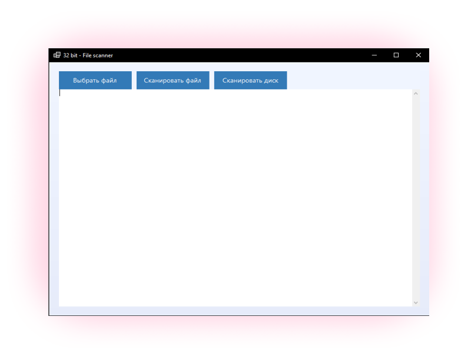

# 32bit - File checker
credits: ChatGpt(да да нейронка) - fix code

[](https://opensource.org/licenses/MIT)

Простой антивирусный сканер для базовой проверки файлов на наличие подозрительных активностей.

## 📦 Основные функции

- Сканирование отдельных файлов и целых директорий
- Обнаружение подозрительных сигнатур в файлах
- Проверка цифровых подписей исполняемых файлов
- Анализ энтропии для выявления упакованных/зашифрованных файлов
- Карантин подозрительных файлов
- Визуализация результатов с цветовой маркировкой

## 🛠️ Требования

- **ОС**: Windows 10/11 (x64)
- **.NET Runtime**: 8.0 или новее
- **Память**: 512 MB RAM
- **Дисковое пространство**: 50 MB

> 💡 Проверьте установленную версию .NET:  
> `dotnet --list-runtimes`

## 🚀 Использование

1. **Меню программы**  
   

2. **Сканирование файла**  
   ```bash
   Нажмите "Сканировать файл" для проверки
